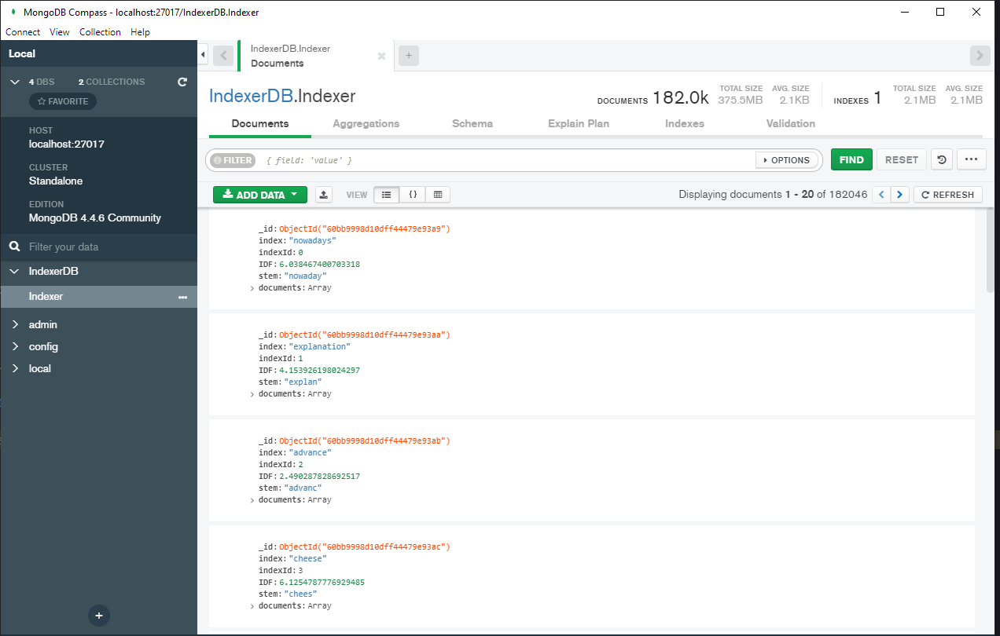
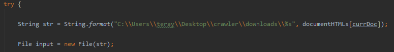
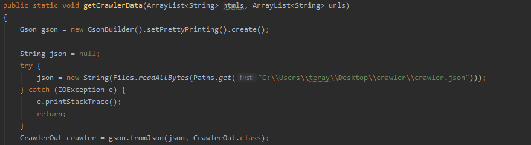

# Search-Engine

## Website

>Written in React

>Disable CORS in your browser to be able to send requests to apache tomcat server

## Server

> Java Servlets that is used to send and recieve json requests with website and accessing database

## Database

>in WEB_INF add a folder lib and add the jar files of mongo-java-driver-3.4.3 and opennlp-tools-1.9.3

>suggestions.json is a mongodb collection with suggestions stored by user and their frequency

## Indexer

> Extract indexer(2119).rar (Contains 2119 HTML indexed - 3.6 M entry of documents in json format)

> Instal MongoDB plugin for java in your editor

> Change file path for Crawler function and Html Reading parts in the "Indexer\src\main\java\org\example\APP.java"

> Run code to generate the Database documents

# Screenshots

 |
 |
:-----------------------------:|

